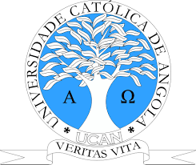

## UNIVERSIDADE CATÓLICA DE ANGOLA
# Sistema de Gestao de Filas-BackEnd
## Introdução

O presente projecto tem como obejectivo agilizar e facilitar o processo de atendimento ao público (público esse composto por estudante) na Secretaria da Universidade Católica de Angola. O projecto deverá ser desenvolvido e entregue num periódo máximo de 2 meses.